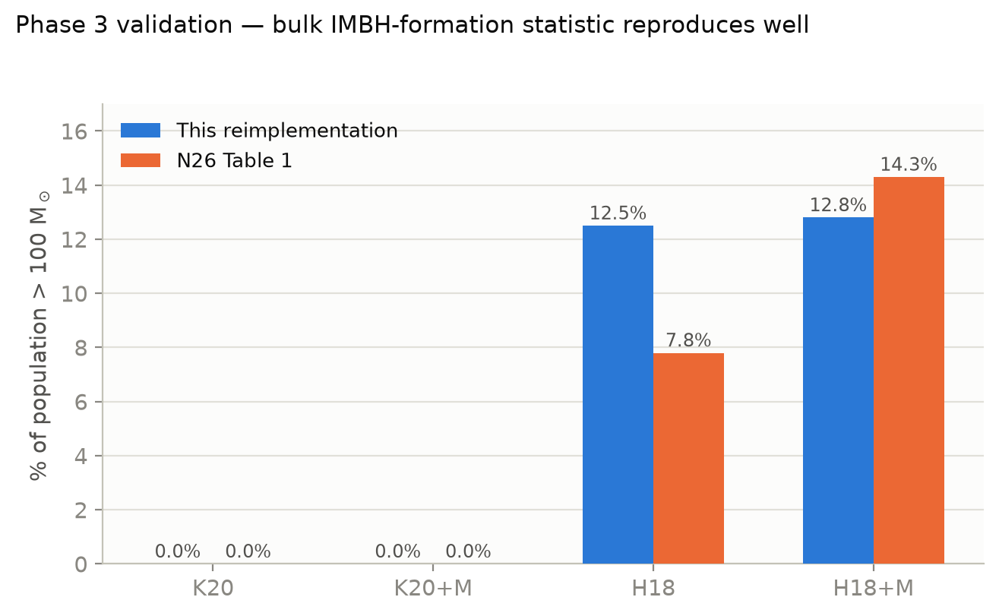
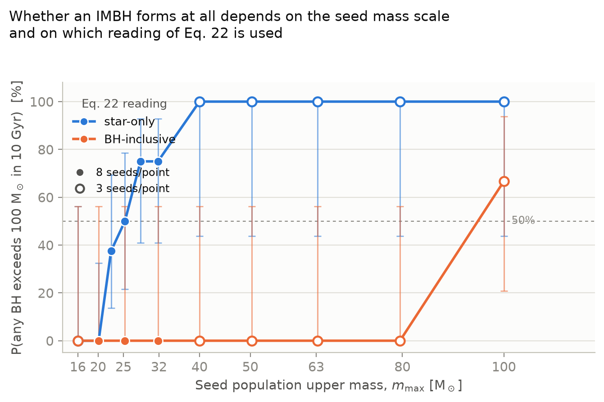
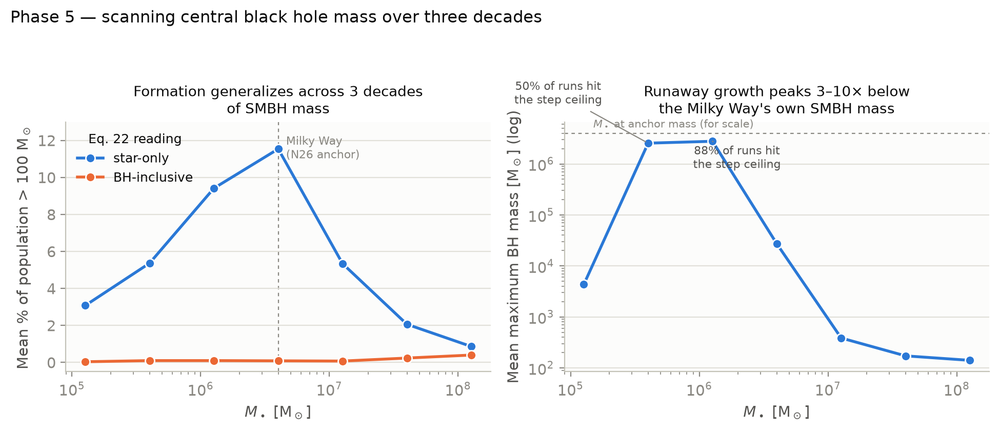

# Results

**Prepared by**: Armeen Shasti-Nazem (University of Washington, <aashasti@uw.edu>) —
independent reimplementation of Newton et al. 2026 (*ApJ*, 1006:184, "Intermediate-mass
Black Hole Formation from Hierarchical Mergers in Galactic Nuclei," hereafter N26).

This is the single consolidated results file — validation, both of N26's Section 5.4
extensions, and the headline numbers behind each, in one place. It replaces browsing
`phase3_validation_2026-07-26.md`, `phase4_mass_threshold_scan_2026-07-27.md`, and
`phase5_smbh_mass_scan_2026-07-28.md` individually; those files (plus the raw per-seed
data in `phase*_raw/`) still exist underneath this one for anyone who wants the full
diagnostic trail. Every number below is reported under **both** readings of the Eq. 22
$\langle M_{\rm avg}\rangle$ ambiguity (see `paper/limitations_summary.md` §2.1) — it is
the single choice that changes almost everything that follows.

## Headline

- **Validation**: the bulk IMBH-formation statistic (% of population > 100 M$_\odot$)
  reproduces N26's Table 1 to within a few points across all four initial conditions.
  The extreme upper-mass tail does not — our heaviest initial condition (H18) produces
  BHs up to **58,000 M$_\odot$** on average vs. Table 1's **407 M$_\odot$** ceiling.
- **Is the critical-mass threshold sharp or gradual?** Gradual. Under the star-only
  Eq. 22 reading, the probability that *any* BH crosses 100 M$_\odot$ rises smoothly from
  0% to 75% across $m_{\rm max}\approx20$–$32$ M$_\odot$, not saturating even at the top
  of that band. Under the BH-inclusive reading, no threshold appears anywhere in the
  tested range.
- **Does it generalize to other SMBH masses?** Yes, conditionally. Under star-only,
  **56 of 56** runs across 3 decades of SMBH mass produced at least one IMBH. Under
  BH-inclusive, **0 of 56** exceeded 0.5% of the population. A sharp side finding: a
  runaway-growth failure mode, absent at the Milky Way's own mass, appears in **50–88%**
  of runs 3–10$\times$ below it.

---

## 1. Validation against Table 1

$N=1000$ BHs, $M_\bullet=4\times10^6\,M_\odot$, 10 Gyr, 3 seeds/IC, all four of N26's
initial conditions.

| IC | Mergers (ours / Table 1) | Max mass, M$_\odot$ (ours / Table 1) | % > 100 M$_\odot$ (ours / Table 1) | EMRI % (ours) |
| --- | ---: | ---: | ---: | ---: |
| K20 | 24.0 / 34 | 39.1 / 28.4 | 0.0% / 0% | 29.6% |
| K20+M | 28.7 / 30 | 46.2 / 57.8 | 0.0% / 0% | 31.9% |
| H18 | 1022.0 / 371 | 58,034 / 407.3 | 12.5% / 7.8% | 34.7% |
| H18+M | 1046.7 / 535 | 11,881 / 526.0 | 12.8% / 14.3% | 35.0% |

**K20 and K20+M reproduce well** — mergers and max mass both within ~1.3–1.5$\times$ of
Table 1, consistent with ordinary seed variance and the K20 mass-function reconstruction
uncertainty (`paper/limitations_summary.md` §2.4).

**H18 and H18+M: the bulk statistic matches, the extreme tail doesn't.** The
population-level metric that matters most for the paper's headline claim — % of BHs
exceeding 100 M$_\odot$ — is close (12.5% vs. 7.8%; 12.8% vs. 14.3%, the latter within
seed noise). But max mass is off by 20–220$\times$, driven by 1–3 BHs per 1000-BH run
undergoing 60–230 merger generations (Table 1's own max is 12–16G) via a genuine
runaway positive-feedback loop in both growth channels — traced mechanistically, not a
coding defect (full trace: `paper/limitations.md#phase2-emri-rate-high`). The 99th-
percentile BH mass (677–851 M$_\odot$ for H18) is much closer to Table 1's scale than
the single most extreme outlier is.

**EMRI rate runs hot across all four ICs**: 30–37% over 10 Gyr here vs. N26's implied
~4–5% (from their ~4–4.8 Gyr$^{-1}$ merger-rate figures, our conversion). Still an open
item — see `paper/limitations_summary.md` §2.1.

---

## 2. Is the critical initial-mass threshold sharp or gradual?

Log-uniform mass family on $[6, m_{\rm max}]\,M_\odot$, $m_{\rm max}$ scanned
16–100 M$_\odot$, $N=1000$, 10 Gyr, both Eq. 22 readings. Filled markers below are
8-seed points (refined pass); open markers are the original 3-seed pass.

| $m_{\rm max}$ [M$_\odot$] | Any IMBH? (star-only) | 95% CI (Wilson) |
| ---: | :---: | :---: |
| 20.1 | 0/8 (0%) | 0–32% |
| 22.6 | 3/8 (38%) | 14–69% |
| 25.3 | 4/8 (50%) | 22–79% |
| 28.4 | 6/8 (75%) | 41–93% |
| 31.8 | 6/8 (75%) | 41–93% |

**Under star-only**, this is a genuine crossover, not a step function: even at
$m_{\rm max}=31.8$ M$_\odot$ — which a thinner 3-seed pass made look fully saturated —
2 of 8 seeds still produce zero IMBHs. Wilson CIs overlap substantially between
adjacent grid points, so the data supports "onset somewhere in ~20–32 M$_\odot$, 50%
point closer to 23–26 M$_\odot$" but not a tighter claim. Beyond 40 M$_\odot$, all
tested points (3 seeds each) saturate at 3/3 — consistent with, but not independently
re-verified at, 8 seeds.

**Under BH-inclusive**, no threshold appears anywhere in the range: flat 0.0% from
16–79.5 M$_\odot$, only 0.1–0.3% even at $m_{\rm max}=100$ (H18 exactly).

**The primordial-binary-merger axis** (N26's own 0%/15% "+M" prescription, tested at
the same 5 grid points, 8 seeds each) has **no detectable effect** on the crossover:
pooled 19/40 (0%) vs. 20/40 (15%) any-IMBH runs, Fisher's exact $p=1.0$. The one clean
effect is a **+2.3%** mean-mass bump at every grid point — matching Phase 3's real
K20/K20+M (+2.2%) and H18/H18+M (+2.4%) shifts almost exactly, a good cross-check that
the extension behaves correctly. Mechanism: primordial mergers touch only ~2.5% of the
population directly, a far smaller lever than one step of the $m_{\rm max}$ grid
(~12% multiplicative).

---

## 3. Does the result generalize to other SMBH masses?

7 $m_{\rm smbh}$ points log-spaced across 3 decades ($1.26\times10^5$–$1.26\times10^8\,
M_\odot$, centered on and including N26's own $4\times10^6\,M_\odot$), H18, 8 seeds/point,
both Eq. 22 readings — 112 runs total.

**Finding 1 — the qualitative Eq. 22 dependence generalizes across all 3 decades.**

| Reading | Pooled any-IMBH | Pooled mean % > 100 M$_\odot$ |
| --- | ---: | ---: |
| star-only | 56/56 (100%) | 5.4% |
| BH-inclusive | 36/56 (64%)* | 0.15% |

*BH-inclusive's binary indicator is noisy and non-monotonic across the grid (2/8 to
8/8 per point) even while the continuous statistic stays flat near zero at every point —
noted as a secondary observation, not elevated to a result.

The paper's qualitative result — H18 produces IMBHs; the alternate Eq. 22 reading
suppresses them — is **not a Milky Way-specific coincidence**. It holds at every SMBH
mass tested, contingent on the same still-open ambiguity. The $m_{\rm smbh}=4\times10^6$
anchor point reproduces Phase 3's H18 validation bit-for-bit for seeds 0–2.

**Finding 2 — a severe, non-monotonic runaway-growth "sweet spot" 3–10$\times$ below
the anchor mass.**

| $m_{\rm smbh}$ [M$_\odot$] | Ratio to anchor | Step-ceiling hit rate | Mean max BH mass [M$_\odot$] |
| ---: | ---: | :---: | ---: |
| $1.26\times10^5$ | 0.03$\times$ | 0/8 (0%) | 4,326 |
| $4\times10^5$ | 0.1$\times$ | 4/8 (50%) | 2,555,496 |
| $1.26\times10^6$ | 0.32$\times$ | 7/8 (88%) | 2,782,188 |
| $4\times10^6$ (anchor) | 1$\times$ | 0/8 (0%) | 27,132 |
| $1.26\times10^7$–$1.26\times10^8$ | 3–32$\times$ | 0/8 (0%) | 141–386 |

In this band, individual BHs reach into the **millions of solar masses** — in several
runs, literally exceeding the central SMBH's own mass. Mechanism: relaxation-driven EMRI
removal weakens as $m_{\rm smbh}$ drops ($t_{\rm relax}\propto M_\bullet^{1.5}$) while
both growth channels' efficiency simultaneously rises ($\propto\sigma^{-2}$-type
scalings) — the two effects cross in this specific band rather than one dominating
everywhere, which is why the lowest mass tested ($1.26\times10^5$, where EMRI removal
wins outright at 97.7%) is *not* where growth is worst.

**Explicitly scoped**: this scan holds the cluster's structural density profile fixed
at the Milky Way's own values while varying only $m_{\rm smbh}$ — our own extension, not
from N26, made to isolate the pure dynamical effect of SMBH mass. A real lower-mass
galactic nucleus plausibly has correspondingly lower density too, which this scan
doesn't model — so Finding 2 is a property of this specific scan design, not a claim
about real low-mass nuclei.

---

## Reproducing these numbers

| Phase | Script | Raw data |
| --- | --- | --- |
| 3 — validation | `scripts/phase3_validation.py` | `results/phase3_validation_2026-07-26_raw.csv` |
| 4 — mass threshold | `scripts/phase4_mass_threshold_scan.py`, `phase4b_threshold_refinement.py`, `phase4c_primordial_binary_check.py` | `results/phase4_raw/`, `phase4b_raw/`, `phase4c_raw/` |
| 5 — SMBH-mass scan | `scripts/phase5_smbh_mass_scan.py` | `results/phase5_raw/` |

Full per-decision reasoning (why each grid, seed count, and Eq. 22 reading was chosen)
is in `paper/limitations_summary.md`; the complete session-by-session log is in
`paper/limitations.md`.
